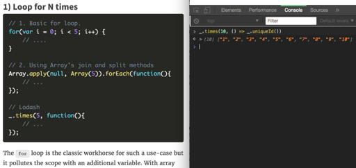
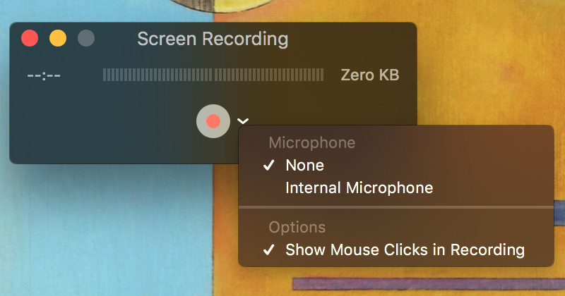

## Web APIs: Reproducing issues and demonstrating solutions!

Behind most successful Web APIs and SaaS Product implementations, there are teams of Success Engineers, Solution Architects, Developer Advocates, and Product Specialists working hard to support users.

* explaining common usage/ snippets/ advice
* investigating more esoteric situations
* identifying bugs and deciding to squash or escalate
* assessing, extending and patching documentation
* writing focused, consumable user guides
* relaying user pain points to product and engineering teams

Questions can range from:
* "Can you help implement the new Product Beta?"
* "your API is not working; is it down?"
* "what happens when I call `yourAPI.method()` in Some Situation?"
* "i dont whant to use cocoapods, how can I install manually?"

The critical information can sometimes be lost in the process where other details are red herrings... so where should an engineer start?
Well, when it comes to debugging data flow: start at the beginning, calmly work through each step, and searching for hidden assumptions.

### A Success Engineer's environment

##### a low-level guide to a setting up a browser testing environment

#### Prerequisites

* A command line!

MacOS users, check out [iTerm2](https://www.iterm2.com/index.html), an upgrade to the native Terminal.
Windows users can leverage [PowerShell](https://docs.microsoft.com/en-us/powershell/)

* Python or Node.js® and NPM [Team Treehouse offers installation guides](https://treehouse.github.io/installation-guides/)

Let's get started, open a command line, and execute:

`$ mkdir enlightenment && cd enlightenment`

You should now be in an empty folder. Let's scaffold an "app":

`$ touch index.html main.js styles.css`

Now, the unattainable is unknowable to you; the only limit is your mind.

Open index.html in your favorite text editor to craft an HTML5 document.

> Fun fact: The [HTML5 specification](https://en.wikipedia.org/wiki/HTML5) was published in October 2014

Now, browser vendors are working to implement APIs like [Media Capture and Streams](https://w3c.github.io/mediacapture-main/getusermedia.html), drag and drop events, new high-res timings!

To get started testing, we just need a few elements in the HTML:

```html
<!DOCTYPE html>
<html lang="en">
<head>
  <meta charset="UTF-8">
  <title>Solutions Environment</title>
  <meta name="viewport" content="width=device-width, initial-scale=1">

</head>
<body>

<h2 id="message" contentEditable=true>Visitor, look within and synergize yourself.</h2>
<!-- Note that any HTMLElement can be editable! :hearteyes: -->
<!-- read more @ https://developer.mozilla.org/en-US/docs/Web/Guide/HTML/Content_Editable -->

<button id="button">Explore Metaphors</button>

<!-- let there be javascript-->
<script src="main.js"> </script>
</body>
</html>
```

You can open this file from your file system, but to interact with non-local servers or to take advantage of "Web API" stuff, a server is needed.
A local server is simple to create, and here are a few ways.

From a terminal window, navigate to your `enlightenment` folder.

If you have a working Python environment,

`$ python -m http.server`

If using node.js and NPM, my choice is [http-server, a simple zero-configuration command-line http server](https://github.com/indexzero/http-server).
I'm a fan of simple tools that address a single concern well; this is one of my favorite examples!

`$ npm install -g http-server`

`$ http-server -o`

Alright! You should be looking at the webpage in your default browser now!

[Pop open the developer tools](https://developer.mozilla.org/en-US/docs/Learn/Common_questions/What_are_browser_developer_tools), and you are in a powerful developer environment—from DOM explorer to a JavaScript console to Network inspection.
You can manipulate page content, freeze the page at any point with a `debugger` statement, and even [set up persistence to local files](https://developers.google.com/web/tools/setup/setup-workflow) in some cases.

Adding a `styles.css` to the folder will give you the final piece to
I find this a more approachable, reliable, and configurable sandbox than something like CodePen or JSFiddle.
Those are great tools for sharing examples, of course!

### What do I do now?

Test the web! The deeper you learn about browsers, the simpler your work becomes.
Bugs can only be fixed once issues are reproducible, and it helps to be familiar with the common patterns and break points.

#### simple examples
Practice examples from articles and blogs as you read them!

[Lodash did it!](https://colintoh.com/blog/lodash-10-javascript-utility-functions-stop-rewriting)


Simply add the library or example scripts to your `index.html` and `main.js`, [jsdelivr.com hosts mirrors](https://cdn.js.com) for many JS libraries!
`<script src="https://cdn.jsdelivr.net/npm/lodash@4.17.4/lodash.js"></script>`

A bare bones testing window offers freedom to "play around" with native Web APIs!

#### DOM Performance testing
Do you know about the [Performance API](https://developer.mozilla.org/en-US/docs/Web/API/Performance)?
You can copy this directly into your main.js:

```js
const parsed = performance.now()
const later =

setTimeout(() => {
    const invoked = performance.now()
    const diff = invoked - parsed
    const div = document.createElement('div')
    div.innerHTML = `
        <p>The browser parsed the JS at ${parsed} ms and executed this onload function at ${invoked} ms<br>
        Meaning the function passed to setTimeout(fn, 2000) executed after ${diff} ms</p>
        `

    const body = document.querySelector('body')
    body.appendChild(div)
}, 2000)
```

Refresh your page and see a demo for how setTimeout works!
It does not tell the JS engine: "execute this in 2 seconds," it drops on the queue and will not be executed *before 2000 ms have ellapsed*.
If another function is blocking, the function passed to setTimeout will be executed "some time" after 2000 ms

After this basic example, you could start exploring [Performance Entries](https://developer.mozilla.org/en-US/docs/Web/API/PerformanceEntry).
With such a small sandbox, you can easily test functions in isolation and improve performance!

#### More API testing
Do you know about the [Fullscreen API](https://developer.mozilla.org/en-US/docs/Web/API/Fullscreen_API)?

Work through the fundamentals with a [blog post](https://www.sitepoint.com/use-html5-full-screen-api/), and then reach for a [pre-built wrapper](https://github.com/sindresorhus/screenfull.js/)!
With a testing framework and flexible mental-model already up and running, you can drop these in quickly to determine which is the right choice for you own development!

___

## In Closing

What do you think? Getting any ideas?
Test them! That's the ticket to achieving.

While you might not be building a fully featured and robust web app with just these three files,
but you can get most basic examples going and iterate!

Of course, as your idea grows, adding more JavaScript functionality and HTML elements,
you will need to split this into more composable chunks...

Research [web components](https://www.webcomponents.org/).
Web components represent a bright future for us developers.

Discover and use the ES6 modules system, unifying JS imports!
Arriving in Node.js 8.x LTS, shipping to browsers quickly; so exciting.

And for CSS, I recommend [tachyons.io](http://tachyons.io/) + [css-tricks.com](https://css-tricks.com/)
After wrestling with CSS for over 10 years, tachyons.io has changed my life.

Some common goals behind each of these are code reuse/ sharing,
more pleasant and intuitive development,
and achieving best practices that improve the end-user experience.

For deployment or hosting, a few tools I've used and can recommend:

* slick with lots of "magic": zeit's [now](https://zeit.co/now)
* used recently for a Python project, [Heroku](https://www.heroku.com) was pleasant!
* If only hosting static pages (apps without a server like the examples in this post), [Firebase](https://firebase.google.com/docs/hosting/) is a nice option too
* todo -- check out Apex's brand new wrapper around AWS! [up](https://apex.github.io/up/#introduction)


### Finally

Hopefully you have a good picture of a straightforward browser environment for manual testing APIs and libraries.

There's more work needed before putting these ideas into production, but fundamentals can really take you far!

If you have been stirred to build some cool tools for the web, follow me on Twitter @wesleynotes and let me know.

____

*Wesley Robinson is a developer excited about Web Components, the future, art and nature.*

____

## Bonus - Sharing your Findings

Whether escalating a bug to another engineer or helping a customer resolve an implementation issue,
often it's someone else that ultimately has to make a code change.
Even after finding a reproducible case, sharing the steps to reproduce or suggestions to resolve can be a real challenge!

Here is some advice and a few helpful tools:

0. Get more productive and automate your box; it's HARD but worth it!

* increase your keyboard repeat rate,
* re-bind your caps lock key to CTRL,
* learn common keyboard shortcuts (alt|cmd + arrowKey),
* get these apps (or similar): aText, Alfred, Spectacle
* upgrade your command line shell to zsh or fish

Listen to this Syntax Podcast on productivity hacks for more great options!

1. Good screenshots take patience, empathy, and practice!

Put some careful effort into planning the demo and make sure your example shines through.
Try to keep your frame tight but be sure to include context for the viewer.

Taking a screenshot is super simple, Mac Users: `⌘ + ⇧ + 3`, Windows Users: Snipping Tool.

If it's not quite right, adjust and take a better screenshot!
Then generously *annotate* your image!

For Mac, you can easily add colorful arrows and text in Preview or Paint in Windows.

2. Good screen recordings are within your grasp!

Again, the more concern you show in the planning phase, the better execution will be.

For Mac, Quicktime is dead simple. Open it and hit CMD + CTRL + n for a new screen recording.
Audio is tricky, so I suggest silent recording first.



Once you're done, watch your video and split it with CMD + Y.
Just delete any unwanted clips and the others slide together!

Iterate! This process will feel quick after a couple of attempts.

3. Easily accessible content accessible is easy

Use file streaming/ sharing services like CloudUp, Dropbox, or Google Docs for direct sharing.
Consider putting your tutorials up in public on Vimeo or YouTube!
This is actually an easy thing to do! Lots of folks clamouring to make sharing easier for you!
